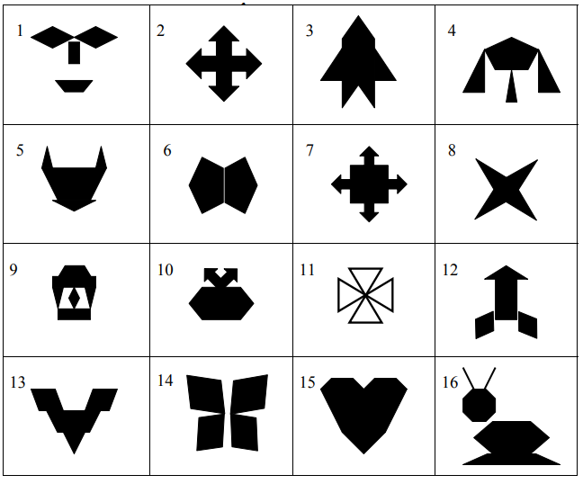
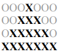

# ITEAHomeWork3_0922

Написать программу, которая выводит на
консоль псевдографического изображения( картинку можно взять любую ). Для
Рисование фигуры применить любой выбранный символ.



Псевдографическое изображение любой сложности может быть выполнено
с помощью ряда уровней из простых геометрических фигур.

Так, для матрицы ниже:



```c++
for (int i=1; i<=4; i++)
{
    for(int j=1; j<=((7-(2*i-1))/2); j++)
        std::cout << "O";

    for(int j=1; j<=(2*i-1); j++)
        std::cout << "X";

    for(int j=1; j<=((7-(2*i-1))/2); j++)
        std::cout << "O";

    std::cout << "\r\n";
}
```